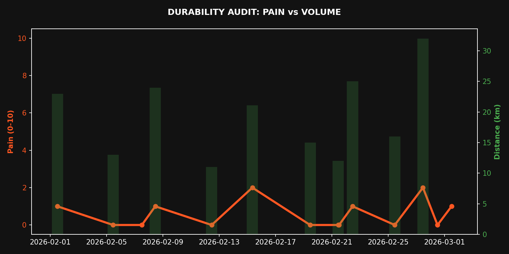

# 🏃 Performance Dashboard

## 🧠 Gemini Resilience Audit

Athlete, your 10kg weight loss is noted, but this isn't a Weight Watchers meeting. We're here to win. Your "target pain score = 0" is consistently ignored. Two out of your last ten sessions recorded a Pain_Score of 2, specifically your 32km long run and the Barcelona Half-Marathon. This indicates you're either pushing into the red too often or lacking the foundational endurance to handle the load without breakdown.

Your training data reveals critical inefficiencies. The 32km run at 5:06/km demanded an average HR of 152bpm, yet you managed the exact same pace for 15km with an Avg_HR of 146bpm. This 6bpm spike for sustained effort highlights a glaring lack of aerobic durability. You're bleeding energy and risking injury trying to hold pace. The 4:11/km half-marathon pace is promising, but the associated Pain_Score of 2 is a red flag, not a badge of honour.

Furthermore, your adherence to the prescribed training split is a joke. Your 32km run, generating a Pain_Score of 2, was executed on a FRIDAY. Fridays are recovery days, not personal ego-projects. This haphazard approach, including double sessions on Saturdays, demonstrates a profound disrespect for your body's recovery needs and the plan designed for your success. Stop making excuses. Hit zero pain, follow the damn schedule, or we re-evaluate your commitment.